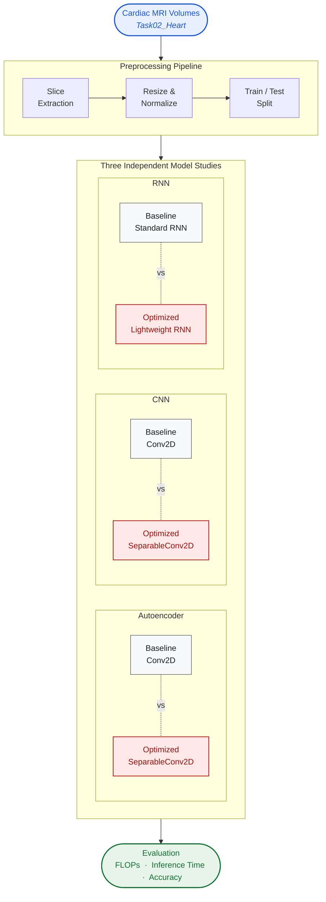
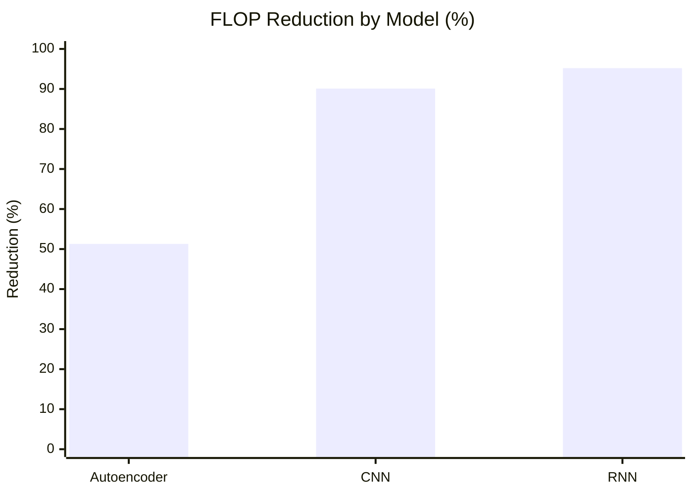
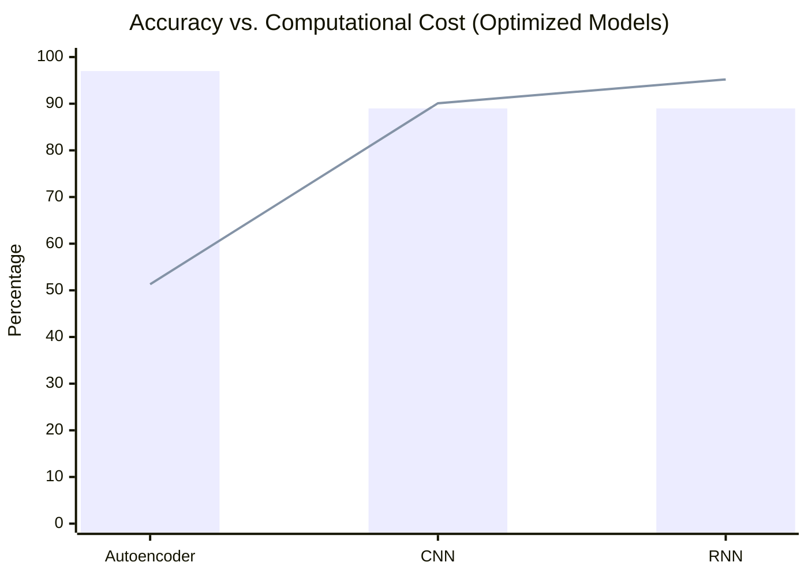

<div align="center">

# CardioLite-Seg

### Lightweight Deep Learning for Cardiac MRI Analysis

*An efficiency-focused study of Autoencoder, CNN, and RNN architectures*

[]()
[]()
[]()
[]()
[]()

</div>

---

## Overview

**CardioLite-Seg** investigates whether established hybrid architectures for cardiac MRI analysis — combining **Autoencoders**, **Convolutional Neural Networks**, and **Recurrent Neural Networks** — can be made substantially more efficient without sacrificing predictive performance.

Rather than proposing a new architecture, this study evaluates three independent model families, each replaced with a lightweight variant built around **separable convolutions**, **reduced parameter footprints**, and **efficient recurrent designs**. The goal: meaningful reductions in FLOPs and inference time while preserving accuracy on the *Medical Segmentation Decathlon — Task02_Heart* dataset.

> Developed as an undergraduate research project in Computer Science and Engineering.

---

## Key Contributions

- A **systematic efficiency study** of three deep learning architectures applied to cardiac MRI
- Drop-in **lightweight replacements** for standard convolutional and recurrent blocks
- Empirical evidence that **51%–95% FLOP reduction** is achievable with comparable accuracy
- A reproducible notebook covering preprocessing, training, and evaluation

---

## System Architecture

The project evaluates three model families **independently** on the same preprocessed cardiac MRI data. Each model has a *baseline* variant and a *lightweight optimized* variant, enabling direct head-to-head comparison rather than forming a single end-to-end pipeline.



<div align="center">

<sub><b>Legend</b> &nbsp;·&nbsp; <span>⬜ Baseline variant</span> &nbsp;·&nbsp; <span>🟥 Optimized variant</span> &nbsp;·&nbsp; <span>🟦 Input</span> &nbsp;·&nbsp; <span>🟩 Evaluation</span></sub>

</div>

---

## Methodology

### 1 · Autoencoder — Representation Learning

Used for image reconstruction and unsupervised feature extraction.
**Optimization:** standard convolutions replaced with depthwise-separable convolutions; reconstruction quality preserved.

### 2 · Convolutional Neural Network — Spatial Features

Used for spatial pattern recognition over MRI slices.
**Optimization:** `SeparableConv2D` substituted for `Conv2D` throughout the encoder, yielding the largest relative FLOP savings.

### 3 · Recurrent Neural Network — Sequential Modeling

Used for sequential analysis of structured features extracted from MRI volumes.
**Optimization:** reduced hidden-state width and lightweight recurrent cell design.

---

## Dataset & Preprocessing

| Property | Value |
|---|---|
| Source | Medical Segmentation Decathlon |
| Task | `Task02_Heart` |
| Modality | Cardiac MRI |
| Format | NIfTI (`.nii.gz`) volumes |

**Preprocessing steps:** slice extraction from 3D volumes · resizing · intensity normalization · train/test split.

<details>
<summary><i>Additional image-processing techniques explored</i></summary>

Otsu thresholding · Adaptive thresholding · Region growing · Watershed algorithm · Sobel edge detection · Canny edge detection.

</details>

---

## Experimental Results

### Computational Cost Reduction



### Detailed FLOP Comparison

<div align="center">

<table>
<thead>
<tr>
<th align="left">Model</th>
<th align="right">Base FLOPs</th>
<th align="right">Optimized FLOPs</th>
<th align="right">Reduction</th>
<th align="left">&nbsp;&nbsp;Magnitude</th>
</tr>
</thead>
<tbody>
<tr>
<td><b>Autoencoder</b></td>
<td align="right"><code>37.04&nbsp;G</code></td>
<td align="right"><code>18.06&nbsp;G</code></td>
<td align="right"><b>51.3 %</b></td>
<td><code>█████░░░░░</code></td>
</tr>
<tr>
<td><b>CNN</b></td>
<td align="right"><code>19.39&nbsp;G</code></td>
<td align="right"><code>&nbsp;1.91&nbsp;G</code></td>
<td align="right"><b>90.1 %</b></td>
<td><code>█████████░</code></td>
</tr>
<tr>
<td><b>RNN</b></td>
<td align="right"><code>1.13&nbsp;M</code></td>
<td align="right"><code>54.4&nbsp;K</code></td>
<td align="right"><b>95.2 %</b></td>
<td><code>██████████</code></td>
</tr>
</tbody>
</table>

</div>

> **Note on scale.** The Autoencoder and CNN operate on full image tensors, while the RNN consumes a flattened sequence of pre-extracted features — hence the very different FLOP magnitudes. Comparisons should be read *within* each model row (base vs. optimized), not across rows.

### Inference Time

<div align="center">

<table>
<thead>
<tr>
<th align="left">Model</th>
<th align="right">Base&nbsp;(s)</th>
<th align="right">Optimized&nbsp;(s)</th>
<th align="right">Speedup</th>
<th align="left">&nbsp;&nbsp;Improvement</th>
</tr>
</thead>
<tbody>
<tr>
<td><b>Autoencoder</b></td>
<td align="right"><code>3.43</code></td>
<td align="right"><code>2.33</code></td>
<td align="right"><b>1.47 ×</b></td>
<td><code>█████░░░░░</code></td>
</tr>
<tr>
<td><b>CNN</b></td>
<td align="right"><code>2.01</code></td>
<td align="right"><code>1.78</code></td>
<td align="right"><b>1.13 ×</b></td>
<td><code>█░░░░░░░░░</code></td>
</tr>
<tr>
<td><b>RNN</b></td>
<td align="right"><code>1.43</code></td>
<td align="right"><code>1.25</code></td>
<td align="right"><b>1.14 ×</b></td>
<td><code>█░░░░░░░░░</code></td>
</tr>
</tbody>
</table>

</div>

---

## Performance Summary

Despite large reductions in computational cost, all three optimized variants retained their baseline accuracy on the held-out test split.

<div align="center">

<table>
<thead>
<tr>
<th align="left">Model</th>
<th align="center">Base&nbsp;Acc.</th>
<th align="center">Optimized&nbsp;Acc.</th>
<th align="center">Δ&nbsp;Accuracy</th>
<th align="center">FLOP&nbsp;Reduction</th>
<th align="center">Speedup</th>
<th align="center">Outcome</th>
</tr>
</thead>
<tbody>
<tr>
<td><b>Autoencoder</b></td>
<td align="center"><code>97 %</code></td>
<td align="center"><code>97 %</code></td>
<td align="center"><b>0.0</b></td>
<td align="center"><b>51.3 %</b></td>
<td align="center"><b>1.47 ×</b></td>
<td align="center">● Preserved</td>
</tr>
<tr>
<td><b>CNN</b></td>
<td align="center"><code>89 %</code></td>
<td align="center"><code>89 %</code></td>
<td align="center"><b>0.0</b></td>
<td align="center"><b>90.1 %</b></td>
<td align="center"><b>1.13 ×</b></td>
<td align="center">● Preserved</td>
</tr>
<tr>
<td><b>RNN</b></td>
<td align="center"><code>89 %</code></td>
<td align="center"><code>89 %</code></td>
<td align="center"><b>0.0</b></td>
<td align="center"><b>95.2 %</b></td>
<td align="center"><b>1.14 ×</b></td>
<td align="center">● Preserved</td>
</tr>
</tbody>
</table>

</div>



<div align="center">

<sub><b>Bars:</b> Optimized accuracy (%) &nbsp;·&nbsp; <b>Line:</b> FLOP reduction (%)</sub>

</div>

> **Caveat.** Accuracy is reported at whole-percentage precision; finer-grained reporting and segmentation-specific metrics (Dice, IoU, HD95) are listed under *Future Work* and are necessary to substantiate these results as a true segmentation study.

---

## Project Structure

```text
CardioLite-Seg/
│
├── notebooks/
│   └── Autoencoders_CNN_RNN.ipynb     # main experimental notebook
│
├── data/
│   └── Task02_Heart/                  # MSD dataset (not tracked)
│
├── results/
│   └── figures/                       # training curves, reconstructions
│
├── requirements.txt
├── README.md
└── LICENSE
```

---

## Installation

```bash
# 1 — clone the repository
git clone https://github.com/your-username/cardiolite-seg.git
cd cardiolite-seg

# 2 — create and activate a virtual environment
python -m venv venv
source venv/bin/activate          # Linux / macOS
# venv\Scripts\activate           # Windows

# 3 — install dependencies
pip install -r requirements.txt
```

**Core dependencies:** `tensorflow` · `keras` · `numpy` · `pandas` · `matplotlib` · `opencv-python` · `scikit-learn` · `nibabel` · `seaborn`

---

## Usage

Open and run the notebook end-to-end:

```bash
jupyter notebook notebooks/Autoencoders_CNN_RNN.ipynb
```

The notebook covers: dataset loading · preprocessing · baseline and optimized model definitions · training · evaluation · FLOP and inference-time benchmarking.

---

## Limitations

The following limitations bound the conclusions of this work and motivate the planned next steps:

- Evaluation uses **accuracy** rather than segmentation-specific metrics (Dice, IoU, HD95).
- Train/test splits are **slice-wise**, not strictly **patient-wise**, allowing potential leakage.
- No external validation on independent datasets such as **ACDC** or **M&Ms**.
- No comparison against established segmentation baselines (**U-Net**, **Attention U-Net**, **nnU-Net**).
- Clinical validation and edge-device deployment testing are out of scope.

---

## Future Work

- Adopt **U-Net**, **Attention U-Net**, **Mobile U-Net**, and **nnU-Net** as baselines
- Report **Dice**, **IoU**, **HD95**, **sensitivity**, **specificity**
- Strict **patient-wise cross-validation**
- External validation on **ACDC** and **M&Ms**
- Apply **pruning** and **quantization**; export to **ONNX**
- Benchmark deployment using **TensorRT** / **ONNX Runtime**
- Add **Grad-CAM** for interpretability

### Suggested Evaluation Metrics

<div align="center">

<table>
<thead>
<tr><th align="left">Metric</th><th align="left">Purpose</th></tr>
</thead>
<tbody>
<tr><td><b>Dice Coefficient</b></td><td>Overlap between prediction and ground truth</td></tr>
<tr><td><b>IoU / Jaccard</b></td><td>Segmentation similarity</td></tr>
<tr><td><b>HD95</b></td><td>Boundary error</td></tr>
<tr><td><b>Precision</b></td><td>False-positive control</td></tr>
<tr><td><b>Recall / Sensitivity</b></td><td>Missed-region control</td></tr>
<tr><td><b>Specificity</b></td><td>Background classification</td></tr>
<tr><td><b>FLOPs</b></td><td>Computational cost</td></tr>
<tr><td><b>Parameters</b></td><td>Model size</td></tr>
<tr><td><b>Inference Time</b></td><td>Deployment speed</td></tr>
<tr><td><b>Memory Usage</b></td><td>Hardware efficiency</td></tr>
</tbody>
</table>

</div>

---

## Academic Context

This project sits at the intersection of:

> *Machine Learning · Deep Learning · Medical Image Analysis · Cardiac MRI Segmentation · Computational Optimization*

---

## Disclaimer

This project is intended for **academic and research purposes only**. It is **not clinically validated** and must not be used for medical diagnosis or treatment decisions.

---

## Citation

If you reference or build on this work, please cite as:

```bibtex
@misc{cardiolite-seg,
  author = {Your Name},
  title  = {CardioLite-Seg: Lightweight Deep Learning for Cardiac MRI Analysis},
  year   = {2025},
  howpublished = {\url{https://github.com/your-username/cardiolite-seg}},
  note   = {Undergraduate research project}
}
```

---

## License

Released for **academic and research use**. See [`LICENSE`](LICENSE) for details.

---

<div align="center">

<sub>Built with TensorFlow · Keras · NumPy &nbsp;·&nbsp; <i>An undergraduate research project</i></sub>

</div>
